# Database Schema Documentation

> **Schema Version:** 2.0 (Cleaned)  
> **Last Updated:** 2025-03-25  
> **Normalization:** 3NF (Third Normal Form)

## Changelog

### Version 2.0 (2025-03-25) - Normalization Cleanup

**Changes Made:**
- **REMOVED** `librarians.name` and `librarians.email` - Now derived from `users` table (3NF compliance)
- **REMOVED** `payments.student_id` - Derivable via `payment → fine → student` relationship
- **REMOVED** `payments.created_at` - Redundant with `payment_date`
- **ADDED** `authors` table - Normalized author management
- **ADDED** `book_authors` junction table - Support for multiple authors per book (4NF)
- **FIXED** Relationship `book_copies → fines` - Removed direct link (fines relate via transactions)
- **FIXED** Cardinality `transactions → fines` - Changed to 1:0..1 (one transaction = max one fine)

**Normalization Improvements:**
- Eliminated transitive dependencies (name/email only in `users`)
- Eliminated redundant foreign keys (payment.student_id)
- Added junction table for multi-valued attribute (authors)
- Achieved 3NF with intentional denormalization only for performance

---

## Overview

- **Database**: PostgreSQL
- **ORM/Query Builder**: sqlc with pgx/v5 driver
- **Migrations**: Located in `backend/internal/database/migrations/`
- **Design Pattern**: Class Table Inheritance (CTI) for user types

---

## Entity Relationship Diagrams

### Complete Schema Overview (Cleaned - 3NF)

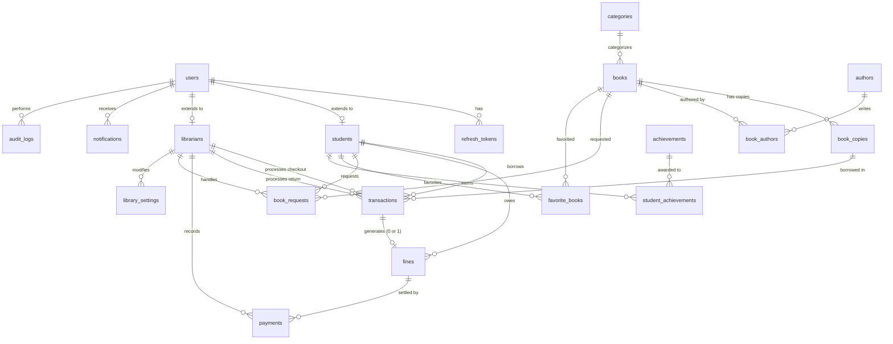

### Users & Authentication

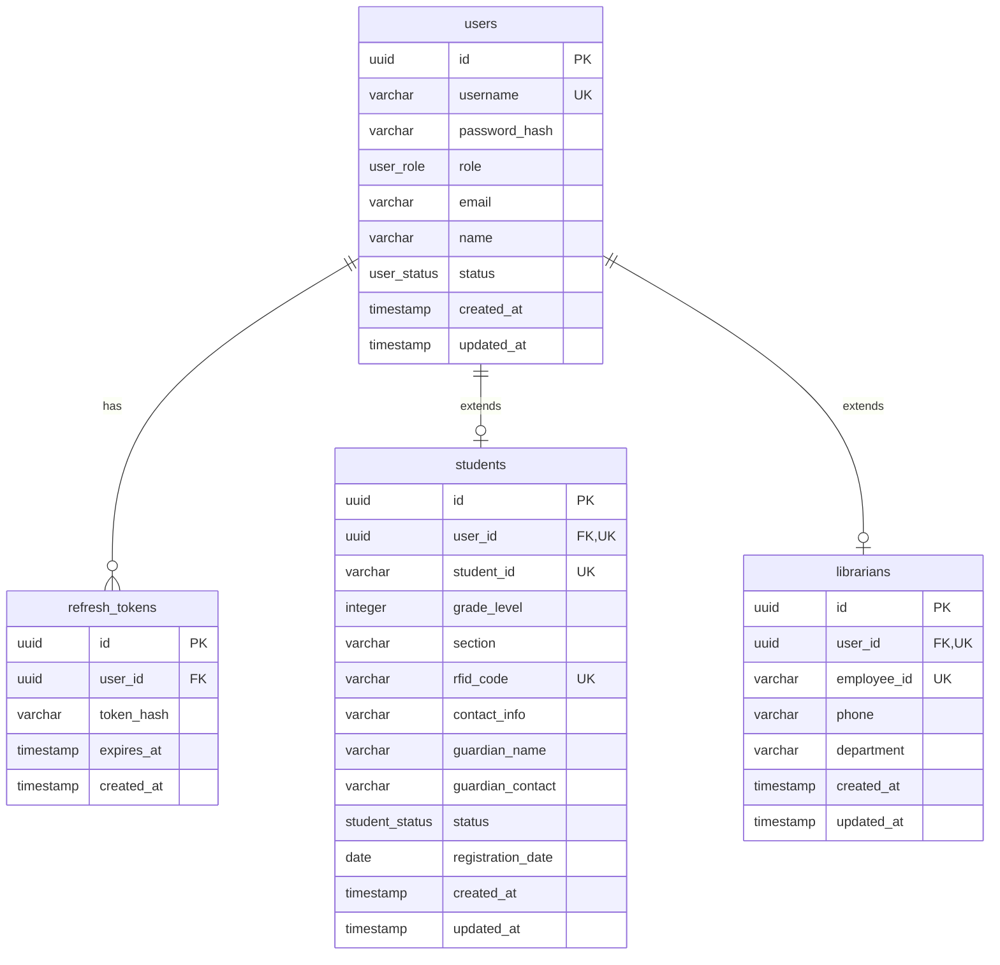

**Normalization Note:** `librarians` no longer has `name` or `email` — these are derived from `users` via the `user_id` relationship (3NF compliance).

### Book Catalog

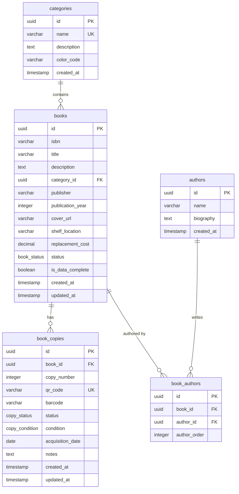

**New in v2.0:** `authors` table and `book_authors` junction table for normalized author management and multi-author support (4NF).

### Circulation System

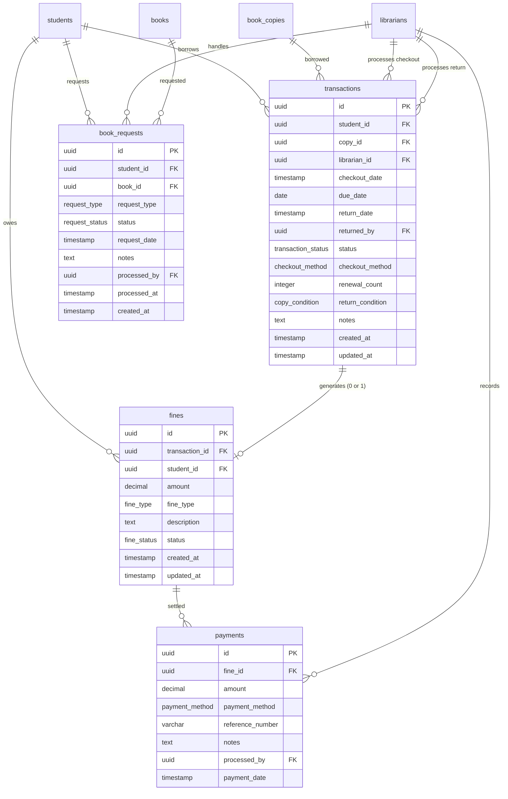

**Cleaned in v2.0:**
- `payments` no longer has `student_id` — derived via `fine → student`
- `payments` no longer has `created_at` — use `payment_date`
- `transactions → fines` is now 1:0..1 (one transaction generates at most one fine)

### Student Features

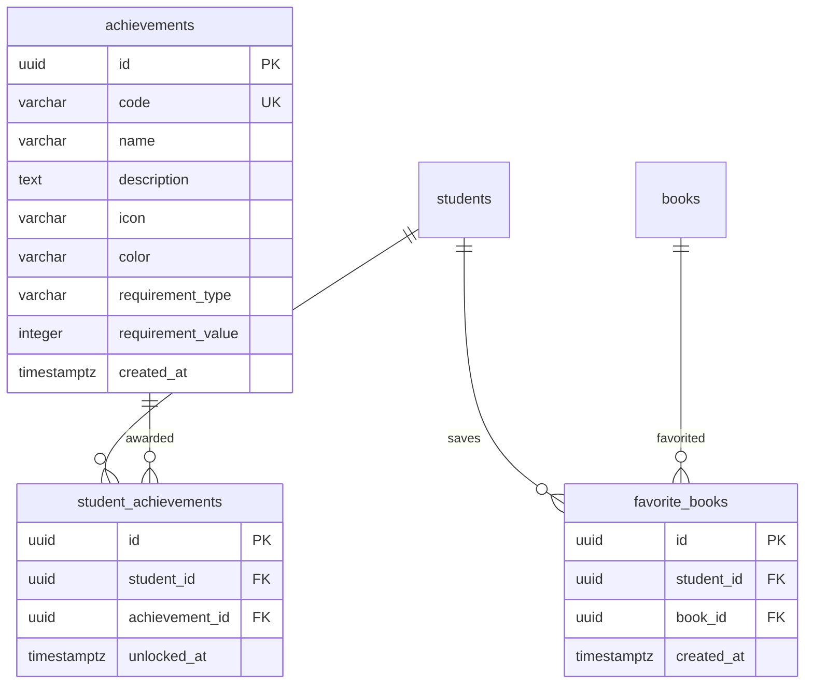

### System Tables

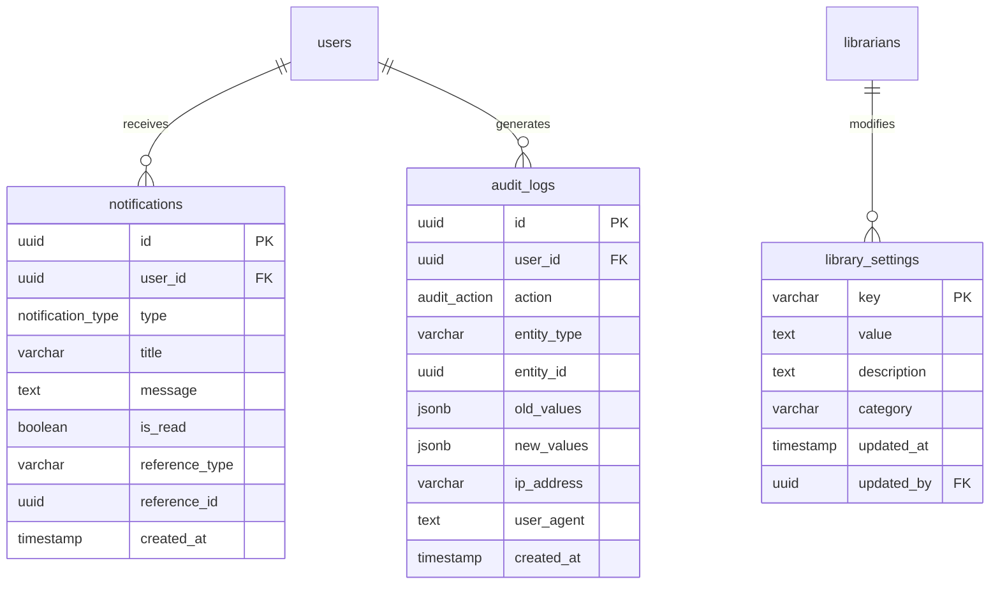

---

## Interaction Diagrams (Workflow Focus)

These diagrams show specific workflows and interactions for presentation purposes.

### 1. User Authentication & Profile Access

**Focus:** How users log in and access role-specific data

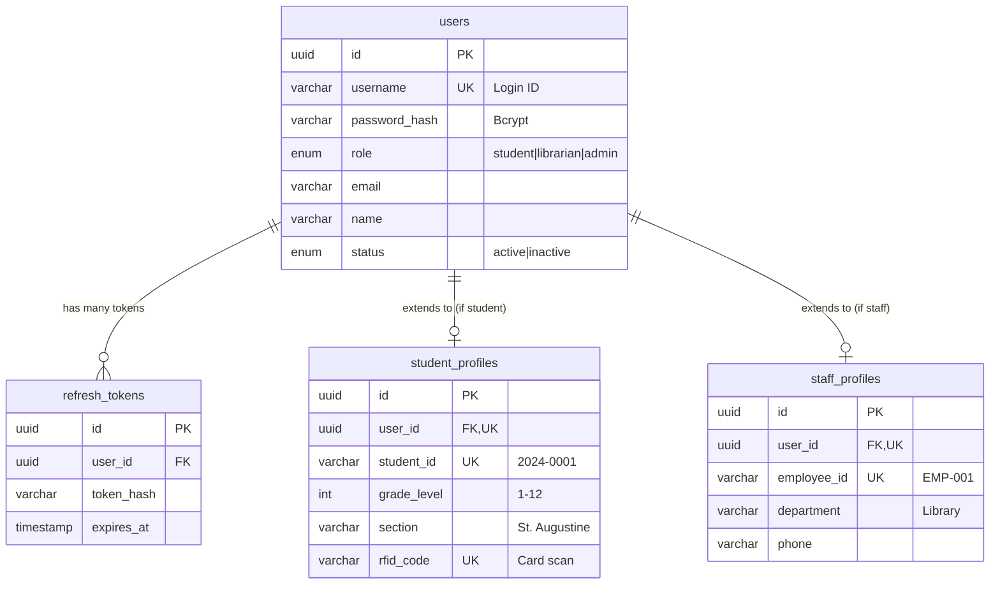

**Key Points:**
- One login (`users`) → multiple possible profiles
- `student_profiles` has school-specific data (grade, section, RFID)
- `staff_profiles` has employment data (employee_id, department)
- **No name/email duplication** — all come from `users`

---

### 2. Book Circulation (Checkout/Return)

**Focus:** The complete borrowing lifecycle

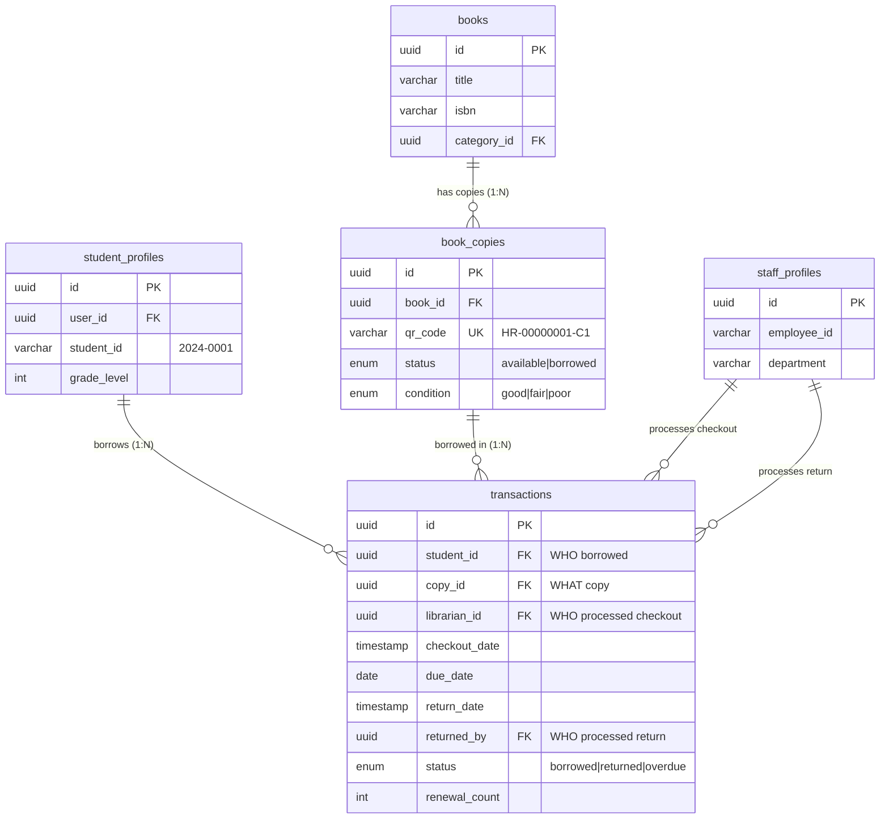

**Key Points:**
- **Master-Detail:** `books` (title) → `book_copies` (individual items)
- **Who did what:** `librarian_id` (checkout) vs `returned_by` (return)
- **Status tracking:** From `borrowed` → `returned` or `overdue`
- **Due date calculated:** Based on `library_settings.loan_duration_days`

---

### 3. Fine & Payment Workflow

**Focus:** How fines are created and paid

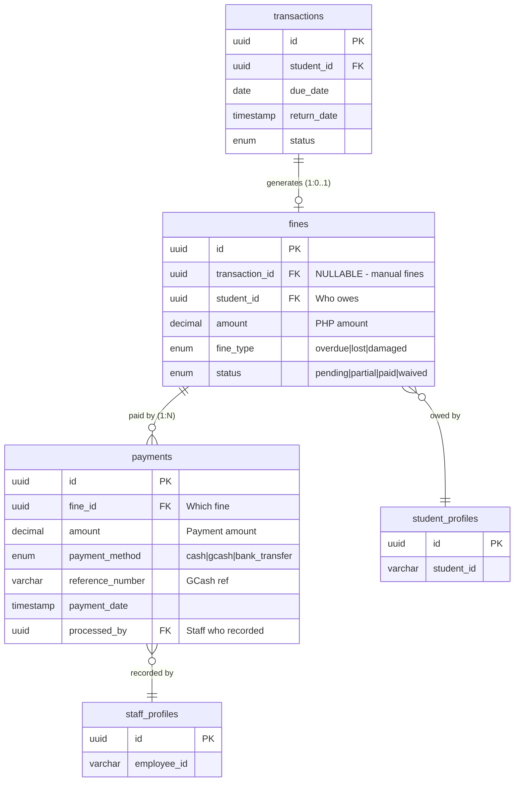

**Key Points:**
- **One transaction = max one fine** (1:0..1)
- **One fine = many payments** (supports partial payments)
- **Student derived:** `payment → fine → student` (no redundant `payment.student_id`)
- **Manual fines supported:** `fine.transaction_id` can be NULL (e.g., lost ID card fee)

---

### 4. Book Request & Reservation

**Focus:** How students request books

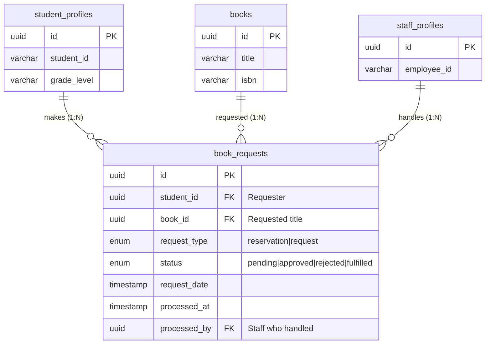

**Key Points:**
- **Title-level requests:** Student requests `books` (title), not `book_copies` (specific copy)
- **Queue system:** Multiple students can request same book → ordered by `request_date`
- **Staff approval:** Librarian approves/rejects and marks `fulfilled` when book ready
- **Two types:** `reservation` (book available) vs `request` (book not in library yet)

---

### 5. Student Engagement (Favorites & Achievements)

**Focus:** Gamification and bookmarks

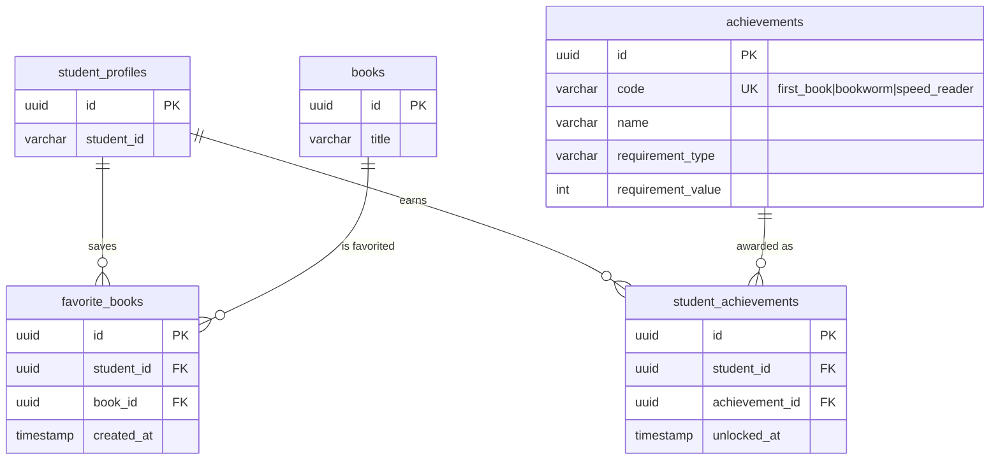

**Key Points:**
- **Junction tables:** Handle many-to-many relationships cleanly
- **Favorites:** Simple bookmarking (student + book + timestamp)
- **Achievements:** Gamification system with unlock tracking
- **4NF Compliance:** Multi-valued attributes handled via junction tables

---

### 6. Audit Trail & Notifications

**Focus:** System tracking and messaging

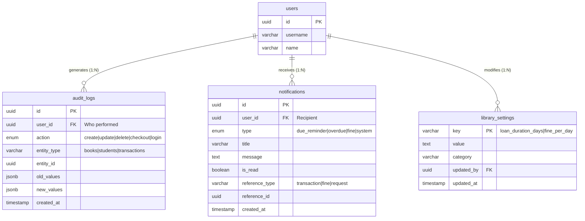

**Key Points:**
- **Audit logs:** Immutable history of all changes (old vs new values in JSONB)
- **Notifications:** User-facing alerts with polymorphic references (can link to transaction, fine, etc.)
- **Settings:** Key-value store for configurable policies

---

## Enum Types

### user_role
| Value | Description |
|-------|-------------|
| `super_admin` | Full system administrator |
| `admin` | School administrator |
| `librarian` | Library staff member |
| `student` | Student user |

### user_status
| Value | Description |
|-------|-------------|
| `active` | User can log in and use the system |
| `inactive` | User account is disabled |
| `suspended` | User account is temporarily suspended |

### student_status
| Value | Description |
|-------|-------------|
| `active` | Currently enrolled student |
| `inactive` | Student is not active |
| `graduated` | Student has graduated |
| `transferred` | Student has transferred to another school |

### book_status
| Value | Description |
|-------|-------------|
| `active` | Book is available for borrowing |
| `archived` | Book is archived |
| `discontinued` | Book is no longer in circulation |

### copy_status
| Value | Description |
|-------|-------------|
| `available` | Copy is available for borrowing |
| `borrowed` | Copy is currently checked out |
| `reserved` | Copy is reserved |
| `lost` | Copy has been lost |
| `damaged` | Copy is damaged |
| `retired` | Copy is retired from circulation |

### copy_condition
| Value | Description |
|-------|-------------|
| `excellent` | Like new condition |
| `good` | Normal wear |
| `fair` | Shows wear but usable |
| `poor` | Significant wear, may need replacement |

### transaction_status
| Value | Description |
|-------|-------------|
| `borrowed` | Book is currently checked out |
| `returned` | Book has been returned |
| `overdue` | Book is past due date |
| `lost` | Book was lost while checked out |

### checkout_method
| Value | Description |
|-------|-------------|
| `counter` | Checked out at library counter |
| `self_service` | Self-service checkout |

### fine_type
| Value | Description |
|-------|-------------|
| `overdue` | Late return fine |
| `lost` | Lost book replacement fee |
| `damaged` | Damaged book fee |
| `other` | Other types of fines |

### fine_status
| Value | Description |
|-------|-------------|
| `pending` | Fine is unpaid |
| `partial` | Fine is partially paid |
| `paid` | Fine is fully paid |
| `waived` | Fine has been waived |

### payment_method
| Value | Description |
|-------|-------------|
| `cash` | Cash payment |
| `gcash` | GCash mobile payment |
| `bank_transfer` | Bank transfer |
| `other` | Other payment method |

### request_status
| Value | Description |
|-------|-------------|
| `pending` | Request is awaiting review |
| `approved` | Request has been approved |
| `rejected` | Request has been rejected |
| `fulfilled` | Request has been completed |
| `cancelled` | Request was cancelled |

### request_type
| Value | Description |
|-------|-------------|
| `reservation` | Book reservation request |
| `request` | Book request (new book or hold) |

### notification_type
| Value | Description |
|-------|-------------|
| `due_reminder` | Reminder that book is due soon |
| `overdue` | Book is overdue |
| `fine` | Fine notification |
| `request_update` | Update on book request |
| `system` | System notification |

### audit_action
| Value | Description |
|-------|-------------|
| `login` | User logged in |
| `logout` | User logged out |
| `create` | Entity created |
| `update` | Entity updated |
| `delete` | Entity deleted |
| `checkout` | Book checked out |
| `return` | Book returned |
| `renew` | Book renewed |
| `fine_created` | Fine created |
| `payment_received` | Payment received |
| `settings_changed` | Settings changed |

---

## Tables

### users

Primary user accounts table for authentication and authorization.

| Column | Type | Constraints | Description |
|--------|------|-------------|-------------|
| `id` | UUID | PRIMARY KEY, DEFAULT gen_random_uuid() | Unique identifier |
| `username` | VARCHAR(50) | UNIQUE, NOT NULL | Login username |
| `password_hash` | VARCHAR(255) | NOT NULL | Bcrypt hashed password |
| `role` | user_role | NOT NULL | User role (super_admin, admin, librarian, student) |
| `email` | VARCHAR(100) | NULLABLE | User email address |
| `name` | VARCHAR(100) | NOT NULL | Full name |
| `status` | user_status | DEFAULT 'active' | Account status |
| `created_at` | TIMESTAMP | DEFAULT CURRENT_TIMESTAMP | Record creation time |
| `updated_at` | TIMESTAMP | DEFAULT CURRENT_TIMESTAMP | Last update time |

**Indexes:**
- `idx_users_name_trgm` - GIN trigram index on name for fuzzy search

---

### refresh_tokens

Stores refresh tokens for JWT authentication.

| Column | Type | Constraints | Description |
|--------|------|-------------|-------------|
| `id` | UUID | PRIMARY KEY, DEFAULT gen_random_uuid() | Unique identifier |
| `user_id` | UUID | FK → users(id) ON DELETE CASCADE | Associated user |
| `token_hash` | VARCHAR(255) | NOT NULL | Hashed refresh token |
| `expires_at` | TIMESTAMP | NOT NULL | Token expiration time |
| `created_at` | TIMESTAMP | DEFAULT CURRENT_TIMESTAMP | Token creation time |

**Indexes:**
- `idx_refresh_tokens_user` - Index on user_id
- `idx_refresh_tokens_expires` - Index on expires_at

---

### students

Extended profile for student users.

| Column | Type | Constraints | Description |
|--------|------|-------------|-------------|
| `id` | UUID | PRIMARY KEY, DEFAULT gen_random_uuid() | Unique identifier |
| `user_id` | UUID | UNIQUE, FK → users(id) ON DELETE CASCADE | Associated user account |
| `student_id` | VARCHAR(20) | UNIQUE, NOT NULL | School-assigned student ID (e.g., "2024-0001") |
| `grade_level` | INTEGER | NOT NULL, CHECK (1-12) | Grade level (1-12) |
| `section` | VARCHAR(50) | NOT NULL | Class section (e.g., "St. Augustine") |
| `rfid_code` | VARCHAR(50) | UNIQUE, NULLABLE | RFID card code |
| `contact_info` | VARCHAR(100) | NULLABLE | Student contact information |
| `guardian_name` | VARCHAR(100) | NULLABLE | Parent/guardian name |
| `guardian_contact` | VARCHAR(50) | NULLABLE | Parent/guardian contact |
| `status` | student_status | DEFAULT 'active' | Student status |
| `registration_date` | DATE | DEFAULT CURRENT_DATE | Date of registration |
| `created_at` | TIMESTAMP | DEFAULT CURRENT_TIMESTAMP | Record creation time |
| `updated_at` | TIMESTAMP | DEFAULT CURRENT_TIMESTAMP | Last update time |

**Indexes:**
- `idx_students_rfid` - Index on rfid_code
- `idx_students_student_id` - Index on student_id
- `idx_students_grade` - Index on (grade_level, section)
- `idx_students_student_id_trgm` - GIN trigram index for fuzzy search
- `idx_students_status_grade_created` - Composite index for filtered queries
- `idx_students_grade_section_status` - Composite index for section queries

---

### librarians

Extended profile for librarian/staff users.

**Cleaned v2.0:** Removed `name` and `email` — now derived from `users` table via `user_id` FK.

| Column | Type | Constraints | Description |
|--------|------|-------------|-------------|
| `id` | UUID | PRIMARY KEY, DEFAULT gen_random_uuid() | Unique identifier |
| `user_id` | UUID | UNIQUE, FK → users(id) ON DELETE CASCADE | Associated user account |
| `employee_id` | VARCHAR(20) | UNIQUE, NOT NULL | Employee ID (e.g., "EMP-001") |
| `phone` | VARCHAR(20) | NULLABLE | Contact phone |
| `department` | VARCHAR(50) | DEFAULT 'Library' | Department name |
| `created_at` | TIMESTAMP | DEFAULT CURRENT_TIMESTAMP | Record creation time |
| `updated_at` | TIMESTAMP | DEFAULT CURRENT_TIMESTAMP | Last update time |

**Normalization Rationale (3NF):**
- `name` and `email` are transitively dependent on `user_id` (they exist in `users` table)
- Storing them here would duplicate data and risk update anomalies
- Access via: `librarians → users` JOIN to get name and email

---

### categories

Book categories/genres.

| Column | Type | Constraints | Description |
|--------|------|-------------|-------------|
| `id` | UUID | PRIMARY KEY, DEFAULT gen_random_uuid() | Unique identifier |
| `name` | VARCHAR(50) | UNIQUE, NOT NULL | Category name |
| `description` | TEXT | NULLABLE | Category description |
| `color_code` | VARCHAR(7) | NULLABLE | Hex color code for UI (e.g., "#3B82F6") |
| `created_at` | TIMESTAMP | DEFAULT CURRENT_TIMESTAMP | Record creation time |

**Seed Categories:**
- Fiction, Non-Fiction, Reference, Science, History
- Mathematics, Literature, Biography, Textbook, Periodical

---

### books

Book catalog master table.

| Column | Type | Constraints | Description |
|--------|------|-------------|-------------|
| `id` | UUID | PRIMARY KEY, DEFAULT gen_random_uuid() | Unique identifier |
| `isbn` | VARCHAR(17) | NULLABLE | ISBN number |
| `title` | VARCHAR(255) | NOT NULL | Book title |
| `description` | TEXT | NULLABLE | Book description/synopsis |
| `category_id` | UUID | FK → categories(id) | Book category |
| `publisher` | VARCHAR(100) | NULLABLE | Publisher name |
| `publication_year` | INTEGER | NULLABLE | Year of publication |
| `cover_url` | VARCHAR(500) | NULLABLE | URL to cover image |
| `shelf_location` | VARCHAR(50) | NULLABLE | Physical shelf location (e.g., "A-001") |
| `replacement_cost` | DECIMAL(10,2) | DEFAULT 0 | Cost to replace the book |
| `status` | book_status | DEFAULT 'active' | Book status |
| `is_data_complete` | BOOLEAN | DEFAULT true | Whether all required fields are filled |
| `created_at` | TIMESTAMP | DEFAULT CURRENT_TIMESTAMP | Record creation time |
| `updated_at` | TIMESTAMP | DEFAULT CURRENT_TIMESTAMP | Last update time |

**Note:** Author information moved to `authors` table with `book_authors` junction table for multi-author support (4NF).

**Indexes:**
- `idx_books_isbn` - Index on isbn
- `idx_books_title` - Index on title
- `idx_books_category` - Index on category_id
- `idx_books_title_trgm` - GIN trigram index for fuzzy title search
- `idx_books_status_created` - Composite index for filtered queries
- `idx_books_category_status_created` - Composite index for category queries

---

### authors

**NEW in v2.0:** Author master table for normalized author management.

| Column | Type | Constraints | Description |
|--------|------|-------------|-------------|
| `id` | UUID | PRIMARY KEY, DEFAULT gen_random_uuid() | Unique identifier |
| `name` | VARCHAR(255) | NOT NULL | Author name |
| `biography` | TEXT | NULLABLE | Author biography |
| `created_at` | TIMESTAMP | DEFAULT CURRENT_TIMESTAMP | Record creation time |

**Indexes:**
- `idx_authors_name` - Index on name
- `idx_authors_name_trgm` - GIN trigram index for fuzzy search

**Rationale (4NF):**
- Books can have multiple authors (multi-valued attribute)
- Authors can write multiple books (many-to-many)
- Junction table `book_authors` resolves this relationship

---

### book_authors

**NEW in v2.0:** Junction table for many-to-many relationship between books and authors.

| Column | Type | Constraints | Description |
|--------|------|-------------|-------------|
| `id` | UUID | PRIMARY KEY, DEFAULT gen_random_uuid() | Unique identifier |
| `book_id` | UUID | FK → books(id) ON DELETE CASCADE | Book |
| `author_id` | UUID | FK → authors(id) ON DELETE CASCADE | Author |
| `author_order` | INTEGER | NOT NULL, DEFAULT 1 | Display order (1=primary, 2=secondary, etc.) |
| `created_at` | TIMESTAMP | DEFAULT CURRENT_TIMESTAMP | Record creation time |

**Constraints:**
- UNIQUE(book_id, author_id) - Prevents duplicate author entries for same book

**Indexes:**
- `idx_book_authors_book` - Index on book_id
- `idx_book_authors_author` - Index on author_id

---

### book_copies

Individual copies of books.

| Column | Type | Constraints | Description |
|--------|------|-------------|-------------|
| `id` | UUID | PRIMARY KEY, DEFAULT gen_random_uuid() | Unique identifier |
| `book_id` | UUID | FK → books(id) ON DELETE CASCADE | Parent book |
| `copy_number` | INTEGER | NOT NULL | Copy number within book (1, 2, 3...) |
| `qr_code` | VARCHAR(100) | UNIQUE, NOT NULL | QR code identifier (e.g., "HR-00000001-C1") |
| `barcode` | VARCHAR(50) | NULLABLE | Barcode identifier |
| `status` | copy_status | DEFAULT 'available' | Copy availability status |
| `condition` | copy_condition | DEFAULT 'good' | Physical condition |
| `acquisition_date` | DATE | NULLABLE | Date acquired |
| `notes` | TEXT | NULLABLE | Additional notes |
| `created_at` | TIMESTAMP | DEFAULT CURRENT_TIMESTAMP | Record creation time |
| `updated_at` | TIMESTAMP | DEFAULT CURRENT_TIMESTAMP | Last update time |

**Constraints:**
- UNIQUE(book_id, copy_number) - Ensures copy numbers are unique per book

**Indexes:**
- `idx_book_copies_qr` - Index on qr_code
- `idx_book_copies_status` - Index on status
- `idx_book_copies_book_id` - Index on book_id
- `idx_book_copies_available` - Partial index for available copies

---

### transactions

Book borrowing transactions (circulation).

| Column | Type | Constraints | Description |
|--------|------|-------------|-------------|
| `id` | UUID | PRIMARY KEY, DEFAULT gen_random_uuid() | Unique identifier |
| `student_id` | UUID | FK → students(id) | Borrowing student |
| `copy_id` | UUID | FK → book_copies(id) | Book copy being borrowed |
| `librarian_id` | UUID | FK → librarians(id) | Librarian who processed checkout |
| `checkout_date` | TIMESTAMP | NOT NULL, DEFAULT CURRENT_TIMESTAMP | Date/time of checkout |
| `due_date` | DATE | NOT NULL | Due date for return |
| `return_date` | TIMESTAMP | NULLABLE | Actual return date/time |
| `returned_by` | UUID | FK → librarians(id) | Librarian who processed return |
| `status` | transaction_status | DEFAULT 'borrowed' | Transaction status |
| `checkout_method` | checkout_method | DEFAULT 'counter' | How the book was checked out |
| `renewal_count` | INTEGER | DEFAULT 0 | Number of times renewed |
| `return_condition` | copy_condition | NULLABLE | Condition upon return |
| `notes` | TEXT | NULLABLE | Additional notes |
| `created_at` | TIMESTAMP | DEFAULT CURRENT_TIMESTAMP | Record creation time |
| `updated_at` | TIMESTAMP | DEFAULT CURRENT_TIMESTAMP | Last update time |

**Indexes:**
- `idx_transactions_student` - Index on student_id
- `idx_transactions_copy` - Index on copy_id
- `idx_transactions_status` - Index on status
- `idx_transactions_due_date` - Index on due_date
- `idx_transactions_active_due_student` - Partial index for active transactions
- `idx_transactions_student_status_due` - Composite index for student queries

---

### fines

Fines and fees for students.

| Column | Type | Constraints | Description |
|--------|------|-------------|-------------|
| `id` | UUID | PRIMARY KEY, DEFAULT gen_random_uuid() | Unique identifier |
| `transaction_id` | UUID | FK → transactions(id) NULLABLE | Related transaction (NULL for manual fines) |
| `student_id` | UUID | FK → students(id) | Student who owes the fine |
| `amount` | DECIMAL(10,2) | NOT NULL | Fine amount in PHP |
| `fine_type` | fine_type | NOT NULL | Type of fine |
| `description` | TEXT | NULLABLE | Fine description |
| `status` | fine_status | DEFAULT 'pending' | Payment status |
| `created_at` | TIMESTAMP | DEFAULT CURRENT_TIMESTAMP | Record creation time |
| `updated_at` | TIMESTAMP | DEFAULT CURRENT_TIMESTAMP | Last update time |

**Indexes:**
- `idx_fines_student` - Index on student_id
- `idx_fines_status` - Index on status
- `idx_fines_student_status_created` - Composite index for queries
- `idx_fines_pending_student_created` - Partial index for pending fines

**Note:** `transaction_id` is nullable to support manual fines not tied to loans (e.g., lost ID card fees).

---

### payments

Payment records for fines.

**Cleaned v2.0:** Removed `student_id` and `created_at` — student is derived via `fine` relationship.

| Column | Type | Constraints | Description |
|--------|------|-------------|-------------|
| `id` | UUID | PRIMARY KEY, DEFAULT gen_random_uuid() | Unique identifier |
| `fine_id` | UUID | FK → fines(id) | Associated fine |
| `amount` | DECIMAL(10,2) | NOT NULL | Payment amount in PHP |
| `payment_method` | payment_method | NOT NULL | Method of payment |
| `reference_number` | VARCHAR(100) | NULLABLE | Payment reference (e.g., GCash ref) |
| `notes` | TEXT | NULLABLE | Additional notes |
| `processed_by` | UUID | FK → librarians(id) | Librarian who processed payment |
| `payment_date` | TIMESTAMP | DEFAULT CURRENT_TIMESTAMP | Date/time of payment |

**Normalization Rationale (3NF):**
- `student_id` was transitively dependent: `payment → fine → student`
- Removing it eliminates redundant data and potential inconsistency
- To find paying student: `payments → fines → students`
- `created_at` removed — `payment_date` serves same purpose

---

### book_requests

Book reservation and request records.

| Column | Type | Constraints | Description |
|--------|------|-------------|-------------|
| `id` | UUID | PRIMARY KEY, DEFAULT gen_random_uuid() | Unique identifier |
| `student_id` | UUID | FK → students(id) | Student making the request |
| `book_id` | UUID | FK → books(id) | Requested book |
| `request_type` | request_type | NOT NULL | Type of request |
| `status` | request_status | DEFAULT 'pending' | Request status |
| `request_date` | TIMESTAMP | DEFAULT CURRENT_TIMESTAMP | Date of request |
| `notes` | TEXT | NULLABLE | Additional notes |
| `processed_by` | UUID | FK → librarians(id) | Librarian who processed |
| `processed_at` | TIMESTAMP | NULLABLE | When request was processed |
| `created_at` | TIMESTAMP | DEFAULT CURRENT_TIMESTAMP | Record creation time |

**Indexes:**
- `idx_requests_pending` - Partial index for pending requests

---

### library_settings

System configuration settings.

| Column | Type | Constraints | Description |
|--------|------|-------------|-------------|
| `key` | VARCHAR(50) | PRIMARY KEY | Setting key |
| `value` | TEXT | NOT NULL | Setting value |
| `description` | TEXT | NULLABLE | Setting description |
| `category` | VARCHAR(50) | NULLABLE | Setting category |
| `updated_at` | TIMESTAMP | DEFAULT CURRENT_TIMESTAMP | Last update time |
| `updated_by` | UUID | FK → users(id) | User who last updated |

**Default Settings:**
| Key | Value | Category |
|-----|-------|----------|
| `loan_duration_days` | 7 | borrowing |
| `max_books_per_student` | 3 | borrowing |
| `max_renewals` | 2 | borrowing |
| `fine_per_day` | 5.00 | fines |
| `fine_grace_period_days` | 1 | fines |
| `max_fine_cap` | 200.00 | fines |
| `fine_block_threshold` | 100.00 | fines |
| `school_year` | 2024-2025 | general |
| `library_name` | Holy Redeemer School Library | general |
| `reading_quota_per_year` | 12 | quota |

---

### notifications

User notifications.

| Column | Type | Constraints | Description |
|--------|------|-------------|-------------|
| `id` | UUID | PRIMARY KEY, DEFAULT gen_random_uuid() | Unique identifier |
| `user_id` | UUID | FK → users(id) | Notification recipient |
| `type` | notification_type | NOT NULL | Type of notification |
| `title` | VARCHAR(255) | NOT NULL | Notification title |
| `message` | TEXT | NOT NULL | Notification message |
| `is_read` | BOOLEAN | DEFAULT false | Whether notification was read |
| `reference_type` | VARCHAR(50) | NULLABLE | Related entity type |
| `reference_id` | UUID | NULLABLE | Related entity ID |
| `created_at` | TIMESTAMP | DEFAULT CURRENT_TIMESTAMP | Creation time |

**Indexes:**
- `idx_notifications_user` - Index on (user_id, is_read)
- `idx_notifications_unread` - Partial index for unread notifications

---

### audit_logs

System audit trail.

| Column | Type | Constraints | Description |
|--------|------|-------------|-------------|
| `id` | UUID | PRIMARY KEY, DEFAULT gen_random_uuid() | Unique identifier |
| `user_id` | UUID | FK → users(id) | User who performed action |
| `action` | audit_action | NOT NULL | Action performed |
| `entity_type` | VARCHAR(50) | NULLABLE | Type of entity affected |
| `entity_id` | UUID | NULLABLE | ID of entity affected |
| `old_values` | JSONB | NULLABLE | Previous values (for updates) |
| `new_values` | JSONB | NULLABLE | New values |
| `ip_address` | VARCHAR(45) | NULLABLE | Client IP address |
| `user_agent` | TEXT | NULLABLE | Client user agent |
| `created_at` | TIMESTAMP | DEFAULT CURRENT_TIMESTAMP | Action timestamp |

**Indexes:**
- `idx_audit_user` - Index on user_id
- `idx_audit_entity` - Index on (entity_type, entity_id)
- `idx_audit_created` - Index on created_at

---

### favorite_books

Student favorite books (bookmarks).

| Column | Type | Constraints | Description |
|--------|------|-------------|-------------|
| `id` | UUID | PRIMARY KEY, DEFAULT gen_random_uuid() | Unique identifier |
| `student_id` | UUID | FK → students(id) ON DELETE CASCADE | Student who favorited |
| `book_id` | UUID | FK → books(id) ON DELETE CASCADE | Favorited book |
| `created_at` | TIMESTAMPTZ | DEFAULT CURRENT_TIMESTAMP | When favorited |

**Constraints:**
- UNIQUE(student_id, book_id) - Prevents duplicate favorites

**Indexes:**
- `idx_favorite_books_student_id` - Index on student_id
- `idx_favorite_books_book_id` - Index on book_id

---

### achievements

Achievement/badge definitions.

| Column | Type | Constraints | Description |
|--------|------|-------------|-------------|
| `id` | UUID | PRIMARY KEY, DEFAULT gen_random_uuid() | Unique identifier |
| `code` | VARCHAR(50) | UNIQUE, NOT NULL | Achievement code |
| `name` | VARCHAR(100) | NOT NULL | Achievement name |
| `description` | TEXT | NOT NULL | Achievement description |
| `icon` | VARCHAR(50) | NULLABLE | Icon identifier |
| `color` | VARCHAR(20) | NULLABLE | Color theme |
| `requirement_type` | VARCHAR(50) | NOT NULL | Type of requirement |
| `requirement_value` | INTEGER | NOT NULL, DEFAULT 1 | Requirement threshold |
| `created_at` | TIMESTAMPTZ | DEFAULT CURRENT_TIMESTAMP | Creation time |

**Default Achievements:**
| Code | Name | Requirement Type | Value |
|------|------|------------------|-------|
| `first_book` | First Book | books_borrowed | 1 |
| `bookworm` | Bookworm | books_read | 10 |
| `speed_reader` | Speed Reader | quick_return | 1 |
| `no_fines_30` | Perfect Record | no_fines_days | 30 |
| `genre_explorer` | Genre Explorer | categories_read | 5 |
| `favorites_collector` | Favorites Collector | favorites_added | 5 |

---

### student_achievements

Junction table for student achievements.

| Column | Type | Constraints | Description |
|--------|------|-------------|-------------|
| `id` | UUID | PRIMARY KEY, DEFAULT gen_random_uuid() | Unique identifier |
| `student_id` | UUID | FK → students(id) ON DELETE CASCADE | Student who earned |
| `achievement_id` | UUID | FK → achievements(id) ON DELETE CASCADE | Achievement earned |
| `unlocked_at` | TIMESTAMPTZ | DEFAULT CURRENT_TIMESTAMP | When unlocked |

**Constraints:**
- UNIQUE(student_id, achievement_id) - Prevents duplicate awards

**Indexes:**
- `idx_student_achievements_student_id` - Index on student_id
- `idx_student_achievements_achievement_id` - Index on achievement_id

---

## Database Functions

### update_updated_at()

Automatically updates the `updated_at` timestamp when a record is modified.

```sql
CREATE OR REPLACE FUNCTION update_updated_at()
RETURNS TRIGGER AS $$
BEGIN
    NEW.updated_at = CURRENT_TIMESTAMP;
    RETURN NEW;
END;
$$ LANGUAGE plpgsql;
```

**Applied to tables:** users, students, librarians, books, book_copies, transactions, fines, payments

---

## PostgreSQL Extensions

### pg_trgm

Enables trigram-based text similarity matching for fuzzy search capabilities.

```sql
CREATE EXTENSION IF NOT EXISTS pg_trgm;
```

Used for GIN indexes on:
- books.title, books.isbn
- users.name
- students.student_id
- authors.name (NEW in v2.0)

---

## Migration Files

| File | Description |
|------|-------------|
| `001_init_schema.sql` | Core schema with all base tables, enums, indexes, and triggers |
| `002_seed_data.sql` | Initial data for categories, settings, sample users, books, etc. |
| `003_favorites_and_achievements.sql` | Adds favorites and gamification features |
| `004_performance_indexes.sql` | Additional performance indexes for common queries |
| `005_schema_normalization.sql` | **NEW in v2.0:** Normalization cleanup (see Changelog) |

---

## Query Files (sqlc)

Query definitions are located in `backend/internal/database/queries/`:

| File | Purpose |
|------|---------|
| `admins.sql` | Admin user queries |
| `audit.sql` | Audit log queries |
| `authors.sql` | **NEW:** Author queries |
| `books.sql` | Book catalog queries |
| `book_authors.sql` | **NEW:** Book-author relationship queries |
| `copies.sql` | Book copy queries |
| `copies_update.sql` | Book copy update operations |
| `favorites.sql` | Favorite books queries |
| `fines.sql` | Fine management queries |
| `librarians.sql` | Librarian queries |
| `notifications.sql` | Notification queries |
| `payments.sql` | Payment queries (updated for v2.0 schema) |
| `reports.sql` | Reporting queries |
| `requests.sql` | Book request queries |
| `school_year.sql` | School year management |
| `settings.sql` | Library settings queries |
| `students.sql` | Student queries |
| `transactions.sql` | Circulation queries |
| `users.sql` | User authentication queries |

---

## Key Business Rules (Enforced by Application)

1. **Borrowing Limits:**
   - Max 3 books per student at a time (`max_books_per_student`)
   - Default loan period: 7 days (`loan_duration_days`)
   - Max 2 renewals per book (`max_renewals`)

2. **Fine Rules:**
   - PHP 5.00 per day for overdue books (`fine_per_day`)
   - 1 day grace period before fines accumulate (`fine_grace_period_days`)
   - Max PHP 200.00 fine cap per book (`max_fine_cap`)
   - Students with PHP 100.00+ in fines are blocked from borrowing (`fine_block_threshold`)

3. **Reading Quota:**
   - Students must read 12 books per school year (`reading_quota_per_year`)

4. **Student Grades:**
   - Grade levels 1-12 (validated by CHECK constraint)

5. **Copy Uniqueness:**
   - Each copy within a book has a unique copy_number
   - QR codes are globally unique across all copies

6. **Normalization Compliance:**
   - **3NF Achieved:** All tables in Third Normal Form
   - No transitive dependencies (name/email only in `users`)
   - No redundant foreign keys (payment.student_id removed)
   - Multi-valued attributes handled via junction tables (book_authors)

---

## Appendix: Normalization Analysis

### 3NF Compliance by Table

| Table | 1NF | 2NF | 3NF | Notes |
|-------|-----|-----|-----|-------|
| users | ✅ | ✅ | ✅ | All attributes depend on user_id |
| students | ✅ | ✅ | ✅ | No transitive dependencies |
| librarians | ✅ | ✅ | ✅ | Removed name/email duplication |
| books | ✅ | ✅ | ✅ | Authors normalized to junction table |
| book_copies | ✅ | ✅ | ✅ | Each attribute describes one copy |
| transactions | ✅ | ✅ | ⚠️ | Status derivable but stored for performance |
| fines | ✅ | ✅ | ✅ | student_id needed for manual fines |
| payments | ✅ | ✅ | ✅ | Removed student_id transitive dependency |
| authors | ✅ | ✅ | ✅ | **NEW** - 4NF for multi-author support |
| book_authors | ✅ | ✅ | ✅ | **NEW** - Junction table (4NF) |

### Design Patterns Used

1. **Class Table Inheritance (CTI):** `users` as supertype, `students`/`librarians` as subtypes
2. **Junction Tables:** `book_authors`, `favorite_books`, `student_achievements` for many-to-many
3. **Master-Detail:** `books` (master) → `book_copies` (detail) for inventory tracking
4. **Status State Machines:** Track lifecycle of transactions, fines, requests

### Intentional Denormalizations

| Field | Table | Reason |
|-------|-------|--------|
| `status` | transactions | Query performance - indexed filtering |
| `is_data_complete` | books | Application convenience - avoids runtime calculation |
| `student_id` | fines | Business flexibility - supports manual fines not tied to loans |
